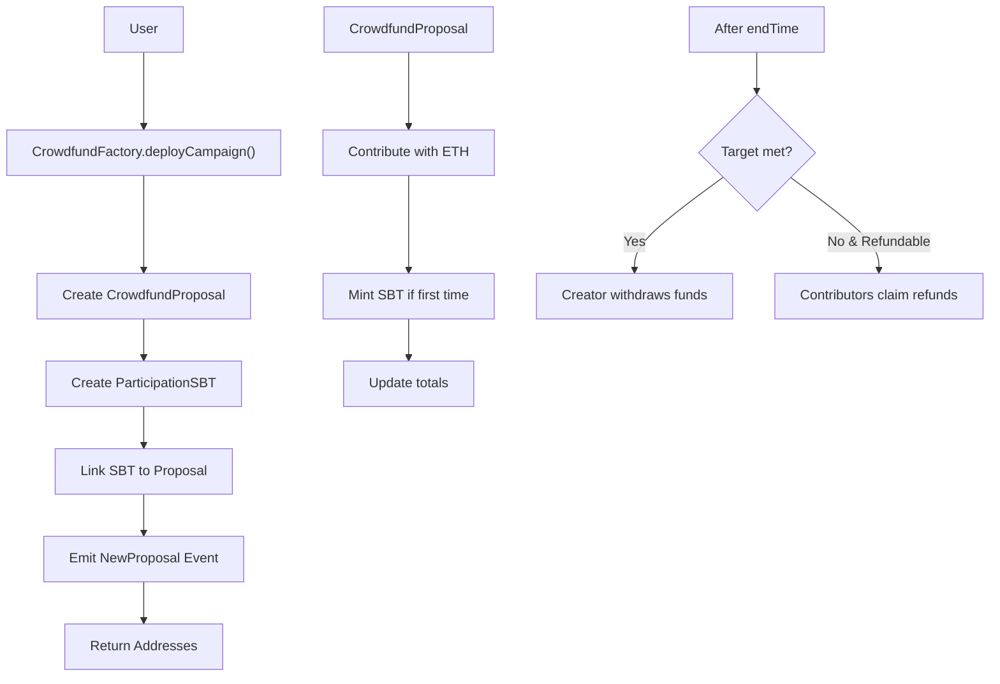
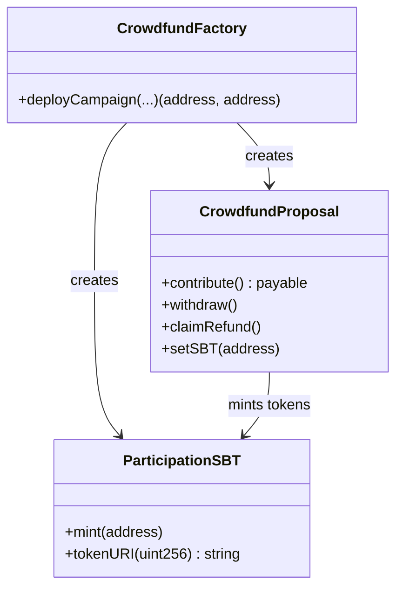

# Aradia Crowdfund Factory    
This project implements a customizable crowdfunding factory on the Astar network (ASTR). It consists of three main contracts:

- **`CrowdfundFactory.sol`**: A factory that creates crowdfunding campaigns with associated Participation Soulbound Tokens (SBTs).
- **`CrowdfundProposal.sol`**: The core crowdfunding contract that manages contributions, withdrawals, and refunds.
- **`ParticipationSBT.sol`**: A non-transferable ERC-721 token representing participation in a crowdfunding campaign.

The project uses OpenZeppelin for ERC-721 and security standards, ensuring security and compatibility.



## Architecture

### CrowdfundFactory.sol
- **Features**:
  - Deploys crowdfunding campaigns with associated SBTs.
  - Links proposal and SBT contracts bidirectionally.
  - No fees; free deployment.

### CrowdfundProposal.sol
- **Inheritance**: ReentrancyGuard.
- **Features**:
  - Configurable target, min contribution, duration, refundability.
  - Tracks contributions and total raised.
  - Mints SBTs for first-time contributors.
  - Allows withdrawals by creator if conditions met.
  - Supports refunds if target not met and refunds enabled.
  - Reentrancy protection and checks-effects-interactions pattern.

### ParticipationSBT.sol
- **Inheritance**: ERC721, Ownable.
- **Features**:
  - Soulbound tokens (non-transferable).
  - Only the proposal contract can mint.
  - Shared metadata URI for all tokens.
  - Represents participation in the campaign.



## Installation and Deployment

### Prerequisites
- Solidity ^0.8.20
- OpenZeppelin Contracts (installed via npm or similar)
- Deployment environment on Astar Network (e.g., Astar Portal, Remix, Hardhat)

### Deployment
1. Deploy `CrowdfundFactory.sol` first (no parameters required).
2. Use the `deployCampaign` function to create custom campaigns.

Example deployment with Hardhat:
```javascript
const CrowdfundFactory = await ethers.getContractFactory("CrowdfundFactory");
const factory = await CrowdfundFactory.deploy();
await factory.deployed();
console.log("CrowdfundFactory deployed to:", factory.address);
```

## Usage

### Creating a Campaign
Call `deployCampaign` with the desired parameters:

```solidity
(address proposalAddr, address sbtAddr) = factory.deployCampaign(
    "ipfs://proposalCID", 
    "ipfs://sbtMetadataURI", 
    "Participation SBT", 
    "PART", 
    10 ether, 
    0.1 ether, 
    30 days, 
    true
);
```

- **Parameters**:
  - `_proposalCID`: IPFS CID with campaign metadata.
  - `_sbtMetadataURI`: Base URI for SBT metadata.
  - `_sbtName`: SBT name.
  - `_sbtSymbol`: SBT symbol.
  - `_target`: Funding target in wei.
  - `_min`: Min contribution in wei.
  - `_duration`: Campaign duration in seconds.
  - `_refundable`: If refunds enabled if target not met.

### Main Functions

#### CrowdfundFactory
- `deployCampaign(...)`: Creates a new campaign with proposal and SBT.

#### CrowdfundProposal
- `contribute()`: Contribute ETH (mints SBT if first time).
- `withdraw()`: Creator withdraws funds if conditions met.
- `claimRefund()`: Contributors claim refunds if campaign failed.
- `setSBT(address)`: Links the SBT contract.

#### ParticipationSBT
- `mint(address)`: Mints a new SBT (only by proposal).
- `tokenURI(uint256)`: Returns metadata URI.

### Events
- `NewProposal`: When a campaign is created.
- `Contributed`: When a user contributes.
- `RefundClaimed`: When a refund is claimed.

## Security and Considerations
- **Reentrancy Protection**: Uses ReentrancyGuard and checks-effects-interactions.
- **Pull Pattern**: Funds withdrawn securely.
- **Soulbound Tokens**: Non-transferable participation proof.
- **Refunds**: Optional; only if target not met.
- **Audit**: Recommended to audit before production.

## License
MIT

---