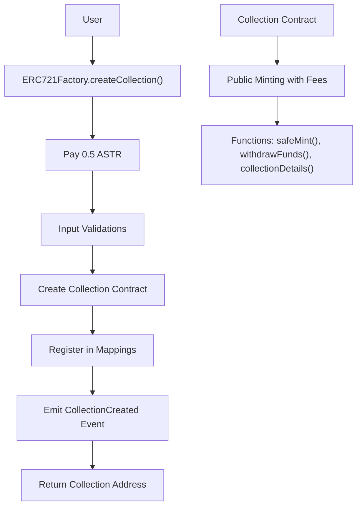
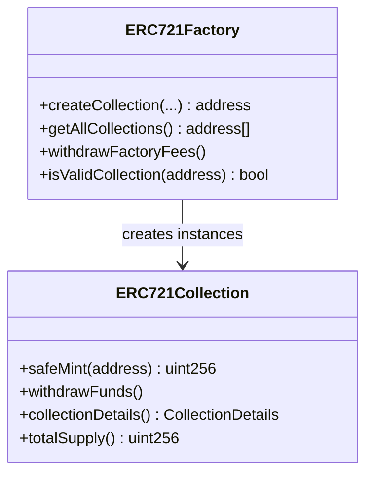

# Aradia ERC721 Factory    
This project implements a customizable ERC-721 collection factory on the Astar network (ASTR). It consists of two main contracts:

- **`ERC721Collection.sol`**: A standard ERC-721 contract with configurable parameters like max supply, mint fee, mint limits per wallet, and scheduled minting start time.
- **`ERC721Factory.sol`**: A factory that allows creating instances of `ERC721Collection` by paying a fixed commission of 0.5 ASTR, with fee withdrawal and collection tracking.

The project uses OpenZeppelin for ERC-721 and Ownable standards, ensuring security and compatibility.



## Architecture

### ERC721Collection.sol
- **Inheritance**: ERC721, Ownable.
- **Features**:
  - Configurable max supply, mint fee, max mint per wallet.
  - Scheduled minting start time.
  - Public minting with exact fee payment.
  - Accumulated funds withdrawal by owner.
  - Fixed base URI for metadata.

### ERC721Factory.sol
- **Features**:
  - Collection creation with commission.
  - Tracking all deployed collections.
  - Secure fee withdrawal using Pull Pattern.
  - Validation of collection addresses.
  - Ownership management.



## Installation and Deployment

### Prerequisites
- Solidity ^0.8.20
- OpenZeppelin Contracts (installed via npm or similar)
- Deployment environment on Astar Network (e.g., Astar Portal, Remix, Hardhat)

### Deployment
1. Deploy `ERC721Factory.sol` first (no parameters required).
2. Use the `createCollection` function to create custom collections.

Example deployment with Hardhat:
```javascript
const ERC721Factory = await ethers.getContractFactory("ERC721Factory");
const factory = await ERC721Factory.deploy();
await factory.deployed();
console.log("ERC721Factory deployed to:", factory.address);
```

## Usage

### Creating a Collection
Call `createCollection` with the desired parameters and send exactly 0.5 ASTR:

```solidity
address collectionAddress = factory.createCollection(
    "MyCollection", 
    "MC", 
    "ipfs://baseURI/", 
    "ipfs://imageURI", 
    "Description", 
    10000, 
    0.1 ether, 
    5, 
    block.timestamp + 3600
);
```

- **Parameters**:
  - `name`: Collection name (string, max 32 chars).
  - `symbol`: Symbol (max 10 chars).
  - `baseURI`: Base URI for metadata.
  - `imageURI`: Image URI for collection.
  - `description`: Collection description.
  - `maxSupply`: Maximum tokens.
  - `mintFee`: Fee per mint.
  - `maxMintPerWallet`: Max mints per wallet.
  - `mintStartTime`: Unix timestamp for mint start.

### Main Functions

#### ERC721Factory
- `createCollection(...)`: Creates a new collection (requires 0.5 ASTR).
- `getAllCollections()`: Lists all created collections.
- `withdrawFactoryFees()`: Withdraws commissions (owner only).
- `isValidCollection(address)`: Verifies if address is a valid collection.

#### ERC721Collection
- `safeMint(address to)`: Mints a token (requires mint fee).
- `withdrawFunds()`: Withdraws accumulated mint fees (owner only).
- `collectionDetails()`: Returns collection metadata.
- `totalSupply()`: Returns total minted tokens.
- `mintStartTime()`: Returns mint start timestamp.

### Events
- `CollectionCreated`: Emitted when creating a collection.
- `WithdrawalCompleted`: When withdrawing factory fees.
- `TokenMinted`: When minting a token.
- `FundsWithdrawn`: When withdrawing mint fees.
- `MintingStarted`: When minting starts.

## Security and Considerations
- **Commission**: Fixed at 0.5 ASTR to prevent spam.
- **Fees**: Exact payment required; no refunds.
- **Minting Limits**: Enforced per wallet and total supply.
- **Scheduled Minting**: Prevents premature minting.
- **Pull Pattern**: Secure fund withdrawals.
- **Audit**: Recommended to audit before production.

## License
MIT

---