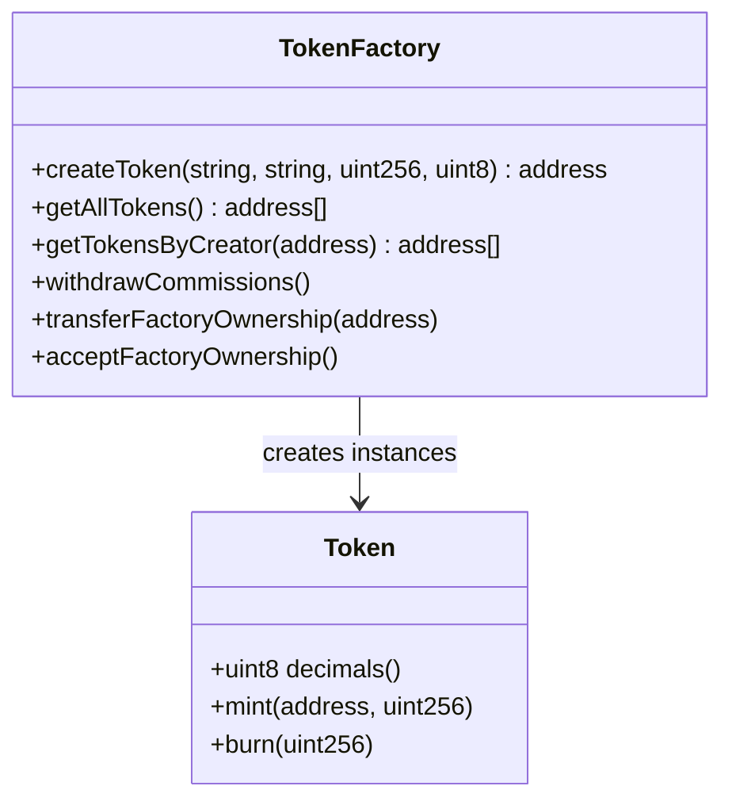

# Aradia Token Factory

## Author
0xNigromante

## Date
1/10/2025

## Technologies


## Overview

This project implements a customizable ERC-20 token factory on the Astar network (ASTR). It consists of two main contracts:

- **`Token.sol`**: A standard ERC-20 contract with configurable decimals, initial supply, and minting/burning functionalities restricted to the owner.
- **`TokenFactory.sol`**: A factory that allows creating instances of `Token` by paying a fixed commission of 2 ASTR, with refund handling and ownership management.

The project uses OpenZeppelin for ERC-20 and Ownable standards, ensuring security and compatibility.

```mermaid
graph TD
    A[User] --> B[TokenFactory.createToken()]
    B --> C[Pay 2 ASTR]
    C --> D[Input Validations]
    D --> E[Create Token Contract]
    E --> F[Register in Mappings]
    F --> G[Emit TokenCreated Event]
    G --> H[Refund Excess if Applicable]
    H --> I[Return Token Address]

    J[Token Contract] --> K[Initial Mint to Creator]
    K --> L[Functions: mint(), burn(), decimals()]
```

## Architecture

### Token.sol
- **Inheritance**: ERC20, Ownable.
- **Features**:
  - Configurable decimals (1-18).
  - Initial supply minted to the owner.
  - Additional minting only by the owner.
  - Burning allowed for any holder.

### TokenFactory.sol
- **Features**:
  - Token creation with commission.
  - Tracking tokens by creator.
  - Automatic refunds and failed refund recovery.
  - Two-step ownership transfer.
  - Withdrawal of accumulated commissions.



## Installation and Deployment

### Prerequisites
- Solidity ^0.8.19
- OpenZeppelin Contracts (installed via npm or similar)
- Deployment environment on Astar Network (e.g., Astar Portal, Remix, Hardhat)

### Deployment
1. Deploy `TokenFactory.sol` first (no parameters required).
2. Use the `createToken` function to create custom tokens.

Example deployment with Hardhat:
```javascript
const TokenFactory = await ethers.getContractFactory("TokenFactory");
const factory = await TokenFactory.deploy();
await factory.deployed();
console.log("TokenFactory deployed to:", factory.address);
```

## Usage

### Creating a Token
Call `createToken` with the desired parameters and send at least 2 ASTR:

```solidity
address tokenAddress = factory.createToken("MyToken", "MTK", 1000000, 18);
```

- **Parameters**:
  - `name`: Token name (string).
  - `symbol`: Symbol (max 10 characters).
  - `initialSupply`: Initial supply (without decimals).
  - `decimals`: Decimals (1-18).

### Main Functions

#### TokenFactory
- `createToken(...)`: Creates a new token (requires 2 ASTR).
- `getAllTokens()`: Lists all created tokens.
- `getTokensByCreator(address)`: Tokens created by a user.
- `reclaimRefund()`: Claims failed refunds.
- `withdrawCommissions()`: Withdraws commissions (owner only).
- `transferFactoryOwnership(address)` / `acceptFactoryOwnership()`: Ownership transfer.

#### Token
- `decimals()`: Returns configured decimals.
- `mint(address to, uint256 amount)`: Mints tokens (owner only).
- `burn(uint256 amount)`: Burns own tokens.

### Events
- `TokenCreated`: Emitted when creating a token.
- `CommissionWithdrawn`: When withdrawing commissions.
- `RefundFailed`: If a refund fails.
- `OwnershipTransferStarted` / `OwnershipTransferred`: Ownership transfer.

## Security and Considerations
- **Commission**: Fixed at 2 ASTR to prevent spam.
- **Refunds**: Automatic; failures are tracked for recovery.
- **Ownership**: Two-step transfer to prevent accidental loss.
- **Validations**: Strict inputs to prevent errors.
- **Audit**: Recommended to audit before production.

## License
MIT

---
